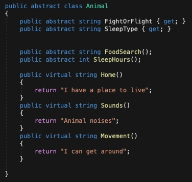
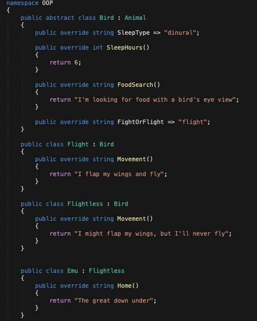
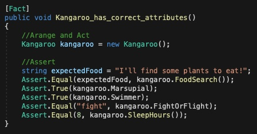

# Lab06-OOP-Principles

*Author: Enrique Hilst*

----

## Description

This is a console application that uses OOP principles to create animal objects made in different classes, and tests inheritance for proper properties and methods. 

---

### Getting Started
Clone this repository to your local machine.

```
$ git clone https://github.com/ehilst515/Lab06-OOP-Principles.git
```

### To run the program from Visual Studio:

Select ```File``` -> ```Open``` -> ```Project/Solution```

Next navigate to the location you cloned the Repository.

Double click on the ```Lab06-OOP-Principles``` directory.

Then select and open ```OOP.sln```

Run unit tests

---

### Visuals






